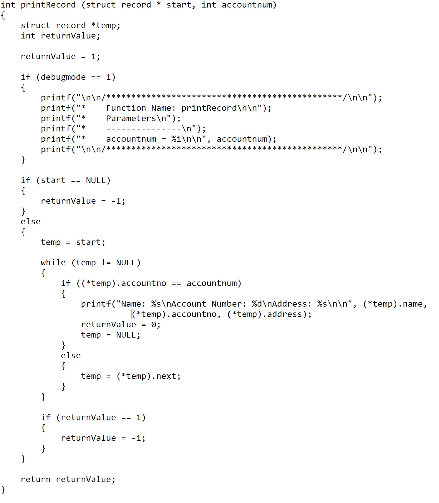

Coding standards, coding styles, coding conventions are all words to represent a set of guidelines for writing quality code that is clean and neat, writing quality code has many benefits, from making it readable for others and yourself all the way to even pointing out potential mistakes or improvement that you can implement to your code. In this class, we are using the IDE, IntelliJ IDEA, with a code quality tool called ESLint, although we are currently writing small non-collaborative projects, coding styles might not seem to be extremely important since no one is reading it but it’s actually extremely useful in learning how to code, because it can help to remind you if a variable was unchanged therefore you can use const to ensure that the variable stays unchanged or it might give you an error saying that a line of code is reductant and that it is not needed, which could help to condense your code.

To understand the importance of coding using coding standards we must imagine what would happen if coding standards were not applied, In this following example:

You can see that this block of code is already pretty unreadable, now imagine 100,000 lines of code that is the same as this one blob of code, first it would be extremely hard to debug your code since you would not be able to pinpoint a certain line of code to find the bug because there are lines of code that are bunched up together, secondly if you were in a collaborative setting, it would be virtually impossible for another person to read and understand what’s going on since it looks like some blob of code mushed together, in contrast, the following image shows an example of neat, quality code that is easy to understand:

Overall, through using ESLint as a code quality tool in this class, I found that it not only helps to make my code readable and neat but it also helped to learn JavaScript much better, for example, it gave me an error when I wrote code that was reductant such as saving the result of an underscore function into a variable then returning it, when i could have just return the underscore function directly which makes the code a line shorter then what it was before, or if I wrote a function that I never used, which might give me a  "Oh Yea I wrote this function, so I can implement it in this other function" moment, which might save me tons of time because I won't have to look through lines and lines of code to find this function that I wrote or accidentally write another function that might do the same thing as this unused function and having ESLint as a tool, we won't have to be put in even more brain power(which I don't have a lot of) to make sure that our code adheres to coding standard and have to read thousands lines of code while manually changes line of codes that violates the coding standards but instead we can do all that with a click of a button because of the amazing tool call ESLint.
