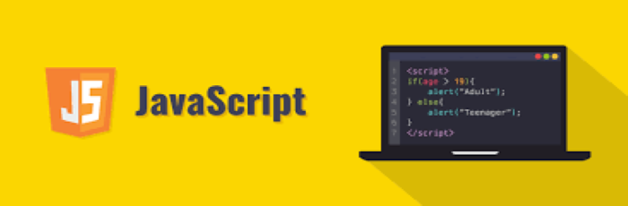

<b>When I first heard of Javascript, I thought it was going to be similar to Java.</b> I have never coded in javascript before and when I heard that we will be learning Javascript in ICS314, I was very excited for I will be adding a new programming language into my arsenal of programming languages which was quite unimpressive(I only knew 3 languages). When I first began E06, I felt that Javascript was very similar to Java except for the fact that there was no need to declare you variable type and you don't have to declare what kind of value that your function will return, which I feel made coding so much easier.

#So then I wonder, what makes Javascript so different from Java?
When there is a question, what does one do? You ask Google! So that's what I did, and I found out that there are tons of differences between Java and Javascript, they weren't even developed by the same company! After searching through the internet, I understood that Javascript is a programming language that does not require a compiler and is usually interpreted by the browser and executed line by line (except in google chrome, which implemented a engine that compiles Javascript code) while Java requires a compiler to translate the language into a machine code for the computer to understand and that although u can use Javascript to create programs such as apps, it's most often used in website to make it more fun and interactive. Other differences are that Java is much more strict in its syntax rules while Javascript is more relaxed and that Java uses block-based scoping meaning that if you create a variable in a block of code, it is only accessible in that block of code unless you set it to be a global variable while Javascript uses function-based scope, meaning that if you declare a variable using "var" anywhere in a function or class, it is declared globally meaning it can be used in any block of code inside the function which is why we declare variable using "let" or "const" in this class.

#My perspective on Javascript
From a software engineering perspective, I feel that Javascript is a great language, it's simple syntax makes it easy for new programmers to learn and it is a language that you encompasses both web-based development and object-oriented programming which is two very important ideas in coding since almost all programs are based on one or both of those ideas. Although I do feel that with the simple syntax, it does make it hard to read and understand code when you are in a huge project since none of the function states their return value and the type of parameter that it takes which I guess could be solved with detailed comments for each function/classes. So overall, I think that Javascript is a great language to learn as with other programming languages.

#My thoughts on Athletic Software Engineering and the WODs
I think that the idea of Athletic Software Engineering is great, although WODs is stressful at times, it prepares us for what it is like when we are looking for work, in which we will be interviewed and be given problems that we must solve while time is of the essence and we will be 10 even 20 times more nervous so doing these WODs will help us acclimate to this kind of environment so that we are better prepared in interviews or maybe even competitions. Also being under a time constraint means that you are more prone to making mistakes which you can learn from and by practicing a WOD multiple times, it can help to eliminate making the same mistakes in future codes. Overall, I feel that although WODs are stressful right now, I feel that once I get used to being in these stressful situations, it will help prepare me for my future career in the working fields.
