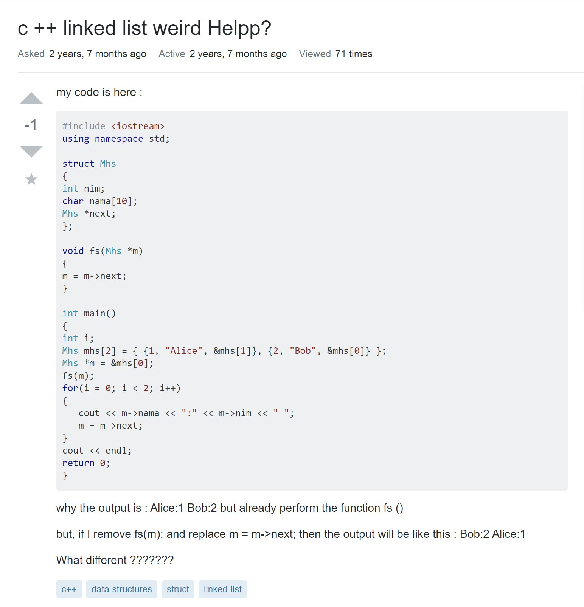

From the reading of Eric Raymond's "<a href = "http://www.catb.org/esr/faqs/smart-questions.html">How To ask questions the smart way</a>", I learned about how important it is to format your questions in a smart way because it is true that there are no dumb questions but it depends on how you ask it, I learned that the way you format your question should show that you have done some extensive searches before asking the question, provide explicit detail in what you want and the place that the error is occurring when asking your question and that you are sincere in asking your question and make the question as easiest as possible for the readers/hackers to understand. From the reading, I also learned that  formating your question correctly is not the only important aspect of asking a smart question, but it also depends on where you ask it, when asking questions, you must make sure that u are asking the question on the related channel/forum so that your question can be properly answered.
   
To demonstrate the differences between a "smart" question and a not as smart one, I have found two different examples on <a href= "https://stackoverflow.com">Stack Overflow</a>:
  
 This is an example of a smart question(you can click on the image to go to the link on Stack Overflow), from this little snippet you can see that this person formatted his question to clearly state his goal and the kinds of error that he was getting the lead to this question, and that his subject header is meaningful and easily understood because he wrote it in the form of an "object-deviation" description, although not shown in this snippet of the page, this person also nicely formated the code that he wrote in nice little chunks of about a dozens line of code and not in one huge chunk of a hundred lines of codes which makes it a lot easier for readers/hackers to analyze. This person also showed sincerity in asking this question because, at the end of his query, he wrote: "Thank you in advance for any help". Summing up everything he did, this was a clear example of a smart question that a reader/hacker would gladly answer.
  
 Here is an example of a not as smart question because the first thing you see is just a huge block of code with no explanation, secondly although writing an "object-oriented" description is hard, just simply saying "c++ linked-list weird Helpp?" does not really show what you need help with, we won't be able to tell if you need help with the sorting of a linked list, the output of a linked list or the linking part of a linked list, simply saying linked list weird doesn't tell anyone anything and saying Helpp makes you sound desperate and decreases the chance of someone helping you with your question. Lastly, you can see that his explanation of his question is both grammatically incorrect and not detailed just saying that your output is not outputting what you expect does not help, instead you should state what you want as your output and then shoe the output you are currently getting, and adding 7 question marks after your question doesn't make it a smarter question. To improve this question, the person should change his subject header to something like "C++ linked-list iteration output error" although it is not "object-oriented" it's tells the reader/hackers what to expect for your question, secondly this person should have snipped his code into three parts, one with the struct, one of the fs function and one with the main function to help organize the question into a more readable format, and finally he should clean up his question by stating the output that he is expecting and the output he is getting and state what he tried to do and maybe even add some information he found online to help format this question into a "smart question".
  
Overall, I learned that formating a question is really important in helping you get the answer that you need and not just some useless answer and that sometimes you might even find the answer to your question while formatting your question which then you won't even need to ask someone for help. Reading the requirement of asking a "smart" question helped me to really think before I ask which would definitely help in my future career because employers don't want someone who just consistently ask questions without trying to solve it first themselves. I also believe that by always trying to solve a problem first by myself will help me become a self-directed learner and I will learn faster this way because I am slowly absorbing the things that I find while searching for a solution to my question and even though they might not be the answers that I am looking for, it might still help in future problems which will help me become a more efficient programmer and one that learns at tremendous rate.

