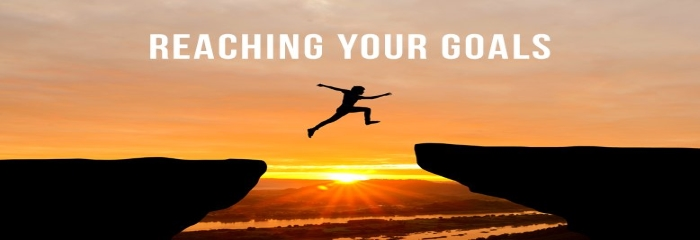

<b>Be a creator/developer and not just a user</b>, this was something that I have always aspired to achieve even as a kid. I was born as a kid who loved to tinker with electronics(.... and sometimes breaking them in the process) and puzzles, I loved how technology was changing and connecting the world and growing up seeing people like Bill Gates and Steve Jobs on TV, I was inspired and it led me to want to create technologies that change the world too and that is what led me down to the path of Computer Science and Software Engineering.

# The Beginning of a journey 
My first experience/exposure was during my senior year in high school because it was the first time that AP Computer Science was ever introduced as a class. When I was a junior hearing about the opportunity of being able to take AP Computer Science, I was really excited because I knew that I wanted to major in Computer Science but I had never had any exposure and see that the course was finally offered was a perfect opportunity for me to see if Computer Science is really right for me. Over the course of AP Computer Science, I learned about basic programming in the Java language, and I loved every moment of coding during that time, the feeling of code that works was a feeling I have never found in any other activities that I was in, and that feeling is what confirmed my decision to major in Computer Science in college.

# A World Awaits
As I continue my journey to becoming a computer science major, I realized how little I truly know, with my slight understanding of Java, C, C++, HTML, and Javascript, I have only explored a fraction of the vast world of Computer Science that still awaits me on the other end, and I hope that I would be able to discover it piece by piece, slowly growing and learning from them and not to just come a better programmer along the way but also a better person because one of my high school told me that you should strive to be the best person for the world and not in the world and that idea is what helps to push our community to become better versions of themselves.

# A Trip Down a Short Memory Lane
Now, as a Sophmore in college, looking back at my journey of becoming a Computer Science major, I am pround of everythign that I overcome but I realize that I am still far from achieving my goal and that being a Computer Science major is a journey that will continue to throw challenges at me but as long as I continue to have a passion for learning and be diligent on pursuing my dream, I believe that I can overcome anything that will be thrown at me because I aspire to be a creator/developer and not just a user while also helping to change the world to become a better place.

