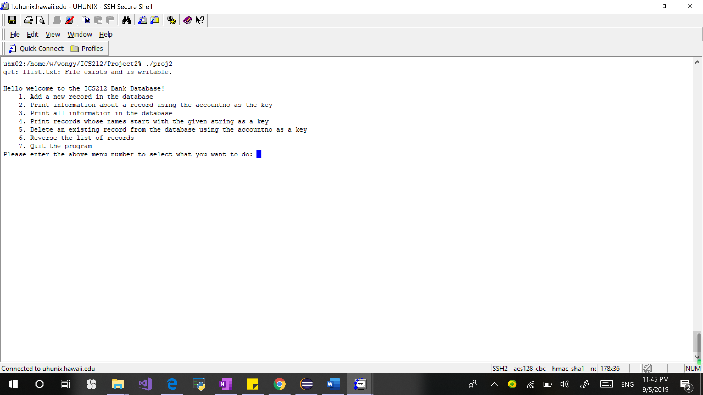
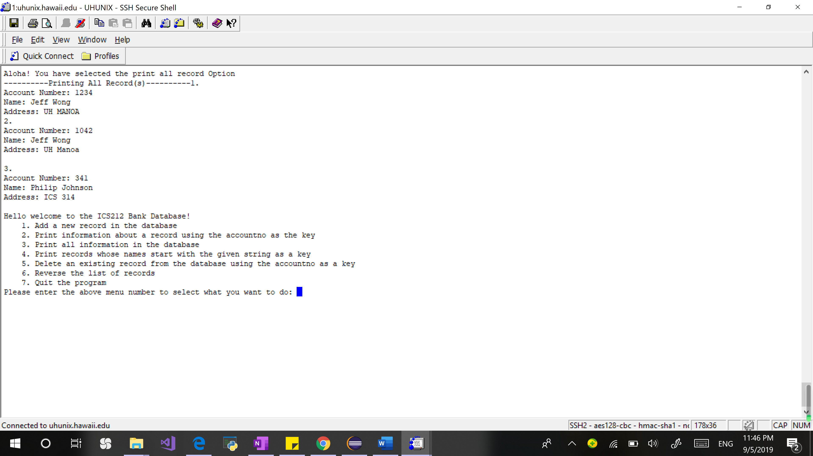
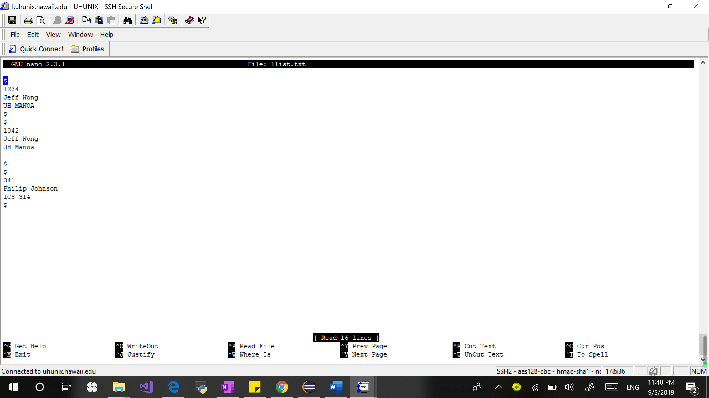

  
  
  
  

Database was the second Project that was assigned to me in ICS212 at the Univeristy of Hawaii at Manoa. This project tasked us creating a database that we coded in C in C++, and added the ability to save all the records in the database on a text file. So not only do we have to change the way we take input and output in our original project, we also had to implement a linked list object that records all the record and writes it to a text file when the program exits.

When I first began this project, I thought it was going to be easy because all I had to do was change the input and output functiond right? Oh god was I wrong, not only do I have to replace the input and output functions, I also had to format everything so that it would look the same as it was in C and this was especially hard since we were using the UNIX system so I had to manually press the down key to scroll through my code.

This Project taught me many different functions and ideas that comes with C++ that was absent in C such how C++ made it so much easier for object-oriented programing by adding the idea of classes and inheritance and support for polymorphism. From this project I also learned the differences betweeen C++ and Java such as it is much faster to run C++ code when compared to Java due to the fact that C++ is a native language which does not require a runtime environment like Java do. C++ also improved a lot from C such as including reference data types which made it much easier because you don't have to keep track of pointers!!! This project not only taught me about the C++ language, it also taught me the importance of creating detailed test cases and testing your program because minor bugs happens a lot when we are not careful, this project also taught me about how much work it is to format a user-friendly program that makes people want to use it.

Overall this project was extremely fun and I learned a lot from this project such as how important program structure is, not only for the users but also the programmers because when you are in the working field, a lot of times projects are done in a group and if your code is not structured and is a buch of mess, your partner(s) are not going to understand your code and that just slow down the project pace. 

You can learn more at my [GitHub](https://github.com/jeff-yc-wong/ICS212/tree/master/Project2).

