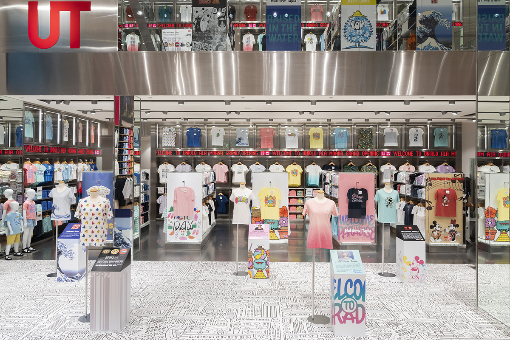

"Zenin Keiei", the idea that everyone is a business leader is what drives UNIQLO to become one of the top retail company in the world! UNIQLO trains all of their employees to embody the "Zenin-Kei" mindset, by embodying this mindset, every employee is responsible to help make the store better and are free to give his/her opinions to the manager to help make the store run smoother and more efficiently, to ensure that each employees understand how the store operates, a weekly action plan is written every week describing the goals of the week and how we can achieve it, the company also post the detail and data of the profit we made on that day called the "Hanbai Keikaku" which is updated every 4 hours to help employees understand what is selling well and what needs to get better. Not only does this mindset help to improve the company, it also helps to improve the employees as a person, because this mindset allows for anyone who is willing to learn, to learn everything about the company. As a UNIQLO employee myself, I feel that by ebodying this mindset I learned skills such as how to run a business's operation smoothly and how to plan ahead.Not only did I learn about the "Zenen Keiei" mindset but mnay other thing suxh as teamwork skills and how to fold clothes nicely!!!
 
Learn more about UNIQLO at: [UNIQLO/about-us](https://www.uniqlo.com/us/en/company/about-uniqlo-us.html).
