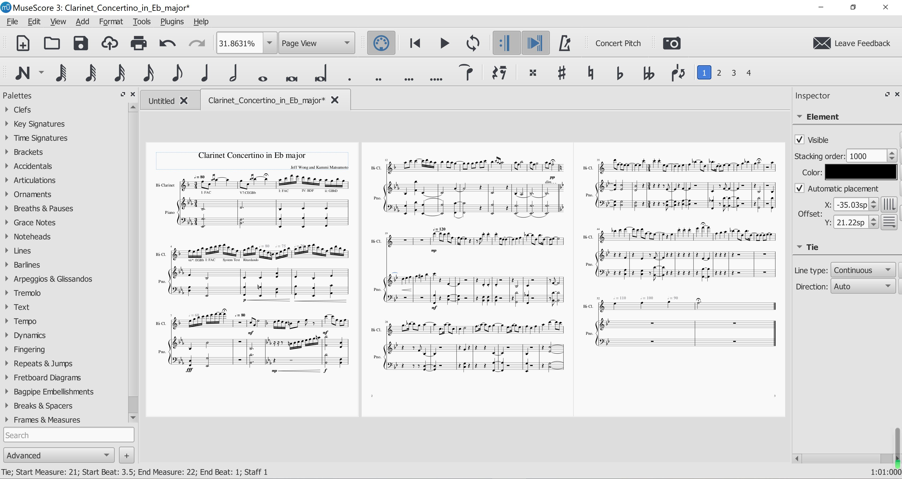

  
  
  

This was my final project for my Music Theory class in high school. My partner(Kammi) and I was tasked with composing a piece on Musescore, a free to download music notation software, that is based on the topic that we researched in our last project, which in this case, I did my research on the topic of concerto while Kammi did her research on the sonata form which fits really well with the form of a concerto. Since I played the clarinet, I wanted to compose a clarinet concerto but because a concerto is extremely long, we decided to compose a slightly different form of a concerto called a concertino which is much shorter and this was the result from it. This piece wasn't really what I hoped it would be but I am proud of this project because in the end my partner and I created this music. Here is an example of what the score looks like in the MuseScore environment:

You can download [MuseScore](https://musescore.org/en) here.
